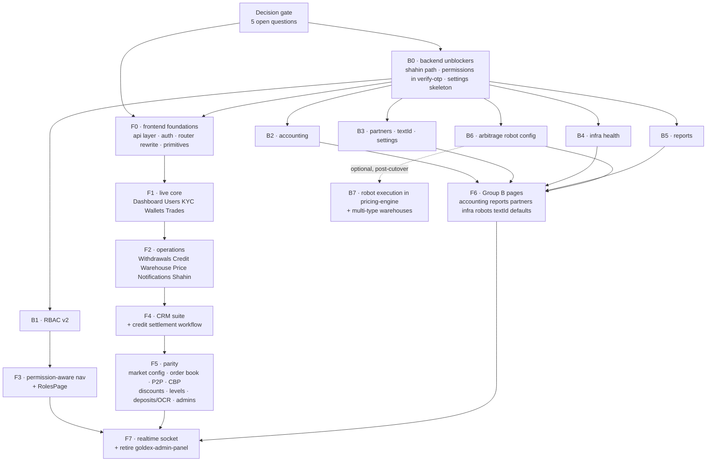
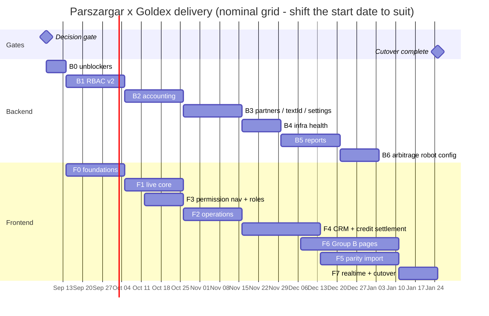

# Parszargar × Goldex — Delivery Roadmap

> Sequenced execution plan across both repos. The *what* lives in
> `PARSZARGAR-BACKEND-PLAN.md` (§ references below are to that file) and
> `ui-parszargar/PARSZARGAR-GOLDEX-PLAN.md`. This file is the *when, in what
> order, and who is blocked on whom*.

**Goal:** one admin panel — the Parszargar shell running on the Goldex API,
at feature parity with `goldex-admin-panel`, which is then retired.

**Sizing assumption:** 2 backend + 2 frontend engineers, working in parallel
lanes. Total effort is ~40 engineer-weeks; at that staffing it lands in ~20
calendar weeks. Re-scale the week numbers if the team differs — the
*dependency order* is what matters and does not change.

---

## 1. Milestones

| # | Milestone | Weeks | Definition of done |
|---|---|---|---|
| **M0** | Decisions & foundations | 1–2 | The five open questions are answered; a Parszargar page renders live backend data end-to-end |
| **M1** | Live core | 3–6 | Dashboard, Users, KYC, Wallets, Trades run on real data; mock generators deleted from those pages |
| **M2** | Roles & daily operations | 5–9 | RBAC v2 shipped; nav is permission-aware; Withdrawals, Credit, Warehouse, Price, Notifications, Shahin live |
| **M3** | Goldex domain import — CRM & Credit | 7–12 | CRM suite and the credit settlement workflow exist in the Parszargar design language |
| **M4** | Feature parity | 10–16 | Everything `goldex-admin-panel` does, Parszargar does |
| **M5** | New backend domains | 9–18 | Accounting, reports, partners, infra health, textId, settings, robot config all live; no stub pages remain |
| **M6** | Cutover | 18–20 | `goldex-admin-panel` read-only, then retired |

M2–M5 overlap heavily. The lane chart in §3 is the accurate picture; the table
above is the summary for a status page.

---

## 2. Dependency graph



**Critical path:** `Decisions → B0 → F0 → F1 → F2 → F4 → F5 → F7`.
Everything on the backend track after B0 is off the critical path *until* F6
needs it — which is why B2–B6 can start early and finish late without hurting.

---

## 3. Lane chart



---

## 4. Milestone detail

### M0 — Decisions & foundations · weeks 1–2

**Gate first.** Five questions (`PARSZARGAR-BACKEND-PLAN.md` §5) must be
answered before a line of RBAC or router code is written. Two of them resize
whole phases:

- *Is Parszargar replacing `goldex-admin-panel` or shipping alongside it?* —
  if alongside, every new endpoint gets two consumers and M6 disappears.
- *Do the per-role limits (fee %, daily withdrawal cap, credit allowance)
  govern admins or the end users they manage?* — decides whether B1 is an
  admin-permissions feature or a customer-tier feature, and whether
  enforcement lives in the guard or in order/withdrawal pricing.

| Track | Work | Effort |
|---|---|---|
| BE | **B0** — fix `@Controller('api/shahin')` (currently resolves to `/api/v1/api/shahin/*`); return `permissions: string[]` from `verify-otp`; stub `admin/settings` | 2 d |
| FE | **F0** — axios client + `unwrap()` for the `{status,message,data,errors}` envelope; react-query; `AuthProvider` port; **router rewrite**; `QueryBoundary` / `Pagination` / column-based `Table` | 3 w |

**Exit:** one page (Dashboard) renders live data behind a real session.

> **The router rewrite is the single riskiest change in the programme.** It
> touches all 41 pages at once. Land it alone, before any data wiring, while
> the pages are still mock-driven and the diff is mechanical.

### M1 — Live core · weeks 3–6

Dashboard, Users + UserCreate, KYC + KycDetail, Wallets + WalletDetails,
Trades. All endpoints already exist — **no backend dependency**.

Backend runs **B1 (RBAC v2)** in parallel: role/permission/role-permission
entities, nine `admin/roles` endpoints, the migration that seeds the four
legacy enum values as system roles and backfills every admin, and the guard
change behind `ADMIN_RBAC_V2=true`.

**Exit:** the core operator loop — find a user, check their KYC, inspect their
wallet, see their trades — works entirely on live data.

### M2 — Roles & daily operations · weeks 5–9

| Track | Work |
|---|---|
| FE | **F3** — `usePermissions()`, `perm` key on every `NAV` entry, route-level `requires`; `RolesPage` / `RoleCreatePage` / `RoleDetailPage` wired to `admin/roles` |
| FE | **F2** — Withdrawals, Credit, Warehouse + WarehouseSearch, Price, Notifications, Shahin (3 of 4 tabs; hide open-banking behind a flag) |
| BE | **B2** — accounting: chart of accounts, vouchers + lines with the Σdebit = Σcredit invariant, the Jalali-bucketed ledger, exports |

The 22 permission keys in `ui-parszargar/src/data/rolesMock.js` are the seed
catalogue — hand them to the backend rather than inventing a second list.

**Exit:** all mock data is gone from `src/data/*` and from the page-local
`Math.random()` generators. This is the milestone where Parszargar stops being
a prototype.

### M3 — CRM & credit settlement · weeks 7–12

The two largest Goldex-only domains, and the two hardest to port:

- **CRM suite** — 7 pages + a 327-line API module: dashboard, customers, the
  360 view, tickets, tags, segments, segment combinations, communications.
  Absorbs the `SupportPage` and `CustomerOverviewPage` stubs.
- **Credit settlement** — 18 components implementing a 12-step settlement state
  machine, collateral locks, cash-outs, PnL, risk panel, pending-approvals
  queue. Parszargar's `CreditPage` today is a chart and a table.

Backend runs **B3** (partners, textId + the `text_id` column and backfill,
settings content) in parallel.

**Exit:** an operator can run a support ticket to resolution and drive a credit
settlement to close, both inside Parszargar.

### M4 — Parity · weeks 10–16

Everything else `goldex-admin-panel` has and Parszargar lacks: symbols, pairs
(incl. routing and bridge-candidates), provider↔pair mappings, order book, P2P
escalations + settings, CBP gateways, discounts + promotions, user levels,
deposits + OCR admin, telegram market, market status, company bank accounts,
finance logs, **admin management + schedules** (Parszargar manages roles but
never admins).

Backend runs **B4** (infra health probes, samples, incidents, monitoring
uptime) and **B5** (reports: definitions, runs, schedules, MinIO artifacts).

**Not imported:** Goldex's `ComparePage` (Parszargar's `PricePage` supersedes
it) and Goldex's `WarehousePage` (weaker than Parszargar's three warehouse
screens).

**Exit:** a feature-by-feature diff against `goldex-admin-panel` comes back
empty.

### M5 — New backend domains land in the UI · weeks 9–18

**F6** wires the Group B pages as each backend phase completes: Accounting +
AccountingDocument (B2), Partners + PartnerCreate (B3), TextId + TextIdDetail
(B3), Settings + Defaults (B3), Providers + Monitoring (B4), Reports (B5),
Arbitrage + RobotForm (B6).

**Exit:** zero «این صفحه در حال توسعه است …» stubs; every nav entry leads
somewhere real, or has been removed.

### M6 — Cutover · weeks 18–20

1. **F7** — Socket.IO admin channel replaces the 2.3-second `setInterval`
   price simulator in `App.jsx`; live badges on deposits/withdrawals and the
   `NotificationBell`.
2. Parallel run: both panels live, Parszargar as primary, for one full
   reconciliation cycle.
3. `goldex-admin-panel` → read-only, with a banner naming the retirement date.
4. Retire.

**Exit:** one panel.

---

## 5. Post-roadmap (explicitly out of scope)

| Item | Why deferred |
|---|---|
| **B7 · arbitrage robot execution** | Live order placement belongs in `goldex-pricing-engine` (it owns the scanner and the provider sockets). Config CRUD in B6 is the safe half; execution is a separate risk conversation. |
| **B7 · multi-type warehouses** | `WarehouseDocumentPage` offers material/crypto/rial/fiat; the warehouse module is material-only. `SymbolTypeEnum` already has the four values, so it is a discriminator + guard relaxation — but it changes settlement paths. |
| **API keys (`ApiPage`)** | Advertises a public-API product that does not exist. Remove the nav entry or label it a mock; do not ship it live-looking. |
| **Shahin open-banking tab** | No backend, no spec. Drop the tab or spec it — do not point it at the transfer endpoints. |
| **TypeScript migration** | 17k LOC of pages. JSDoc typedefs (F0) carry the type information without a big-bang conversion. |

---

## 6. Risk register

| Risk | Impact | Mitigation | Owner |
|---|---|---|---|
| Router rewrite regresses pages silently | High | Land alone in M0, before data wiring, while diffs are mechanical | FE |
| RBAC guard change breaks every admin route | High | Entities + read endpoints first; guard flip in a separate PR behind `ADMIN_RBAC_V2` | BE |
| Re-skinning cost underestimated | High | ~1 day per non-trivial imported page, not 1 hour. 25+ pages in M3–M4. Budget it explicitly. | FE |
| TS → JS port loses safety on credit settlement | Med | JSDoc typedefs ported from `api/types.ts` (1,107 lines) alongside each API module | FE |
| Jalali strings reach request bodies | Med | Convert once, at the API layer. `gregorianDate` is the source of truth; `jalali_date` is a denormalised grouping key. | Both |
| Two panels consuming every new endpoint | Med | Fix the retirement date at M0, not at M6 | Lead |
| Accounting scope creep (ledger of record vs. reporting overlay) | Med | Answer question 2 at the M0 gate; B2 assumes ledger of record | BE |
| Multi-currency ledger needs `getRateAt(symbolId, at)` | Low | Spec the helper during B2 design, not during B2 build | BE |

---

## 7. Tracking

Each phase is one epic. Suggested issue titles, in dependency order:

```
B0  backend: unblock the Parszargar shell (shahin path, permissions, settings stub)
F0  frontend: api layer, real auth, router rewrite, page primitives
B1  backend: RBAC v2 — custom roles, permission matrix, per-role limits
F1  frontend: wire the core loop (dashboard, users, kyc, wallets, trades)
F3  frontend: permission-aware navigation + roles pages
F2  frontend: wire operations (withdrawals, credit, warehouse, price, notifications, shahin)
B2  backend: accounting — chart of accounts, vouchers, Jalali ledger
F4  frontend: import CRM suite + credit settlement workflow
B3  backend: partners, textId, system settings
F5  frontend: parity import (market config, order book, p2p, cbp, discounts, levels, deposits/ocr, admins)
B4  backend: infra health + monitoring uptime
B5  backend: reports service
B6  backend: arbitrage robot configuration
F6  frontend: wire the Group B pages, remove all stubs
F7  frontend: realtime socket + goldex-admin-panel cutover
```

**Health checks at each milestone boundary:**
`npm run typecheck` and `npm run build` in `goldex-backend`;
`npm run lint` and `npm run build` in `ui-parszargar`; plus a manual
smoke of the login → dashboard → one detail page path, since neither repo has
meaningful test coverage today.
