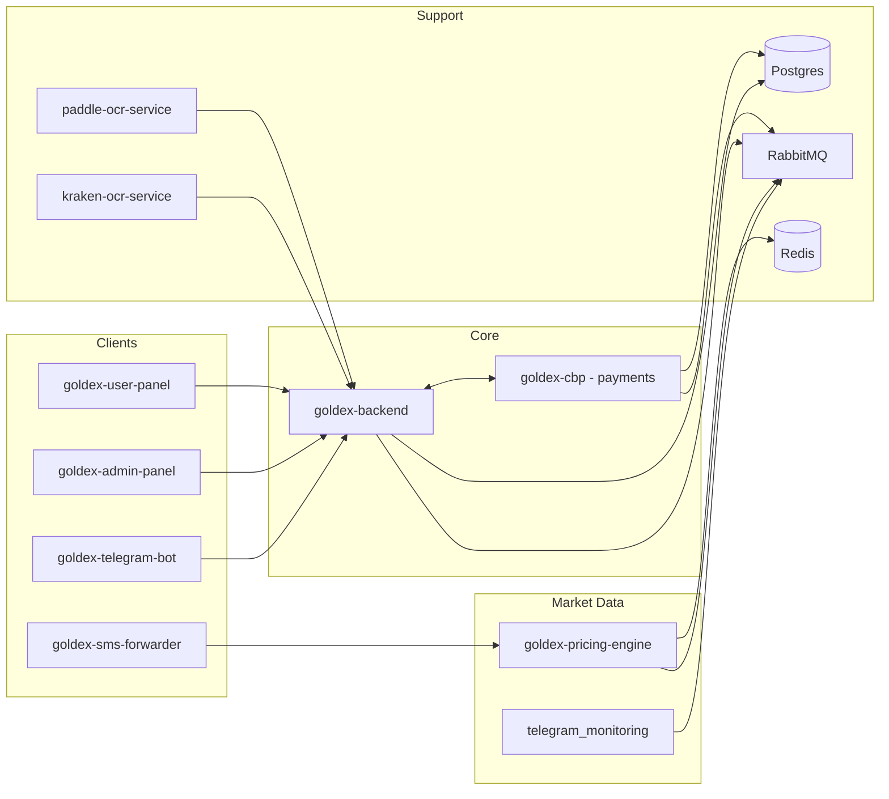

# GOLDEX — Gold Trading Platform

> A multi-service, real-time gold & precious-metals trading platform. Live
> provider price feeds, cross-provider arbitrage detection, a Telegram-based
> custom (P2P) market, an automated payment engine, KYC, wallets, warehouse
> (inventory) operations, OCR document processing, and full admin/customer web
> panels.

**Goldex** combines live market data from external gold providers, an automated
central-bank payment engine, a Telegram order-matching market, and an
admin/customer web experience into one unified trading system.

---

## 🧩 System Overview



---

## 🏗️ Services

| Service | Type | Purpose |
|---|---|---|
| **goldex-backend** | NestJS API | Core REST API: users, auth (OTP + password), KYC, wallets, orders, quote-requests (custom market), warehouse, deposits/withdraws, notifications, CRM, finance, admin. Owns Postgres + orchestrates everything. |
| **goldex-cbp** | NestJS (headless) | Central-bank payment engine. Consumes RabbitMQ commands, executes provider gateway transfers (Kaino/Shahin), verifies callbacks, publishes payment lifecycle events. |
| **goldex-pricing-engine** | NestJS | Real-time provider pricing. Connects to gold providers (Talaab, Zaryar, mock) over WebSocket/SignalR, normalizes + caches prices in Redis, and runs a live cross-provider **arbitrage scanner**. |
| **telegram_monitoring** | NestJS | Telegram channel monitor. Parses provider price messages, detects arbitrage / best-price / price-movement opportunities, renders chart images, forwards alerts, and tracks a virtual wallet. |
| **goldex-telegram-bot** | NestJS bot | User-facing Telegram bot (GramJS). Registration, OTP login, and a **custom P2P quote market** — place quotes, publish to channel, peer fulfill/accept, auto-match. |
| **goldex-user-panel** | React (Vite) SPA | Customer web app: trade, elite-trade, offers, wallets, warehouse, KYC, sessions, settings, credit, levels, notifications, support. Real-time market via Socket.IO. |
| **goldex-admin-panel** | React (Vite) TS SPA | Operator console: users, KYC, wallets, finance, CBP payments, provider finance, symbols/pairs/mappings, order-book, deposits/withdraws, OCR admin, telegram market, CRM. |
| **paddle-ocr-service** | Python FastAPI | OCR text extraction (PaddleOCR, Arabic) for payment/ID document uploads. |
| **kraken-ocr-service** | Python FastAPI | OCR with a self-training loop + optional RabbitMQ async worker. |
| **goldex-sms-forwarder** | Android (Kotlin) | Listens for OTP notifications and forwards captured codes to complete provider activation. |
| **monitor** | Node | Operational monitoring/health utilities. |

### Shared infrastructure

- **PostgreSQL** — source of truth for backend, cbp, pricing-engine.
- **Redis** — real-time price cache, price history, pub/sub for arbitrage & market updates.
- **RabbitMQ** — async commands/events between backend ⇄ cbp ⇄ pricing-engine ⇄ monitoring.

---

## 🚀 Getting Started

### Prerequisites

- Node.js 18+ / npm (backend, bots, panels)
- Python 3.9+ (OCR services)
- Docker + Docker Compose (Postgres, Redis, RabbitMQ)
- Android Studio / Gradle (sms-forwarder)

### Quick start (development)

```bash
# 1. Infrastructure
docker-compose up -d postgres redis rabbitmq

# 2. Core backend
cd goldex-backend
npm install
npm run start:dev

# 3. Payment engine
cd ../goldex-cbp
npm install
npm run start:dev

# 4. Pricing engine + monitoring
cd ../goldex-pricing-engine
npm install
npm run start:dev
```

Each service reads its own `.env` — copy from `.env.example` and fill credentials.

> **Note on docs:** the repository ships a password-protected archive `docs.zip`
> containing the full system architecture, per-service feature graphs, and
> ERDs. The passphrase is distributed separately (deploy secrets / shared
> vault) and is intentionally **not** committed to source control.

---

## 📁 Repository Layout

```
.
├── goldex-backend/            # Core NestJS API
├── goldex-cbp/                # Payment engine
├── goldex-pricing-engine/     # Provider pricing + arbitrage
├── telegram_monitoring/       # Channel monitor + market maker
├── goldex-telegram-bot/       # User Telegram bot (P2P market)
├── goldex-user-panel/         # Customer web app
├── goldex-admin-panel/        # Admin web app
├── paddle-ocr-service/        # PaddleOCR API
├── kraken-ocr-service/        # Kraken OCR + self-training
├── goldex-sms-forwarder/      # Android OTP forwarder
├── monitor/                   # Operational monitoring
├── postgres-init/             # DB bootstrap scripts
├── tools/                     # Dev utilities
├── docs.zip                   # Encrypted documentation
├── docker-compose.yml         # Service orchestration
└── warehouse-roadmap.html     # Warehouse roadmap
```

---

## 🔐 Security

- JWT + OTP (SMS) authentication, password + device (session) management.
- Payment callbacks verified against provider gateways before settlement.
- OCR feedback loop for continuous document-recognition improvement.
- Passwords, secrets, and the docs passphrase are managed via environment /
  secrets stores — never hardcoded or committed.

---

## 🧪 Testing

Each NestJS service ships Jest unit tests plus e2e suites with shared
infrastructure:

```bash
cd goldex-backend
npm run test        # unit
npm run test:e2e    # integration
```

---

## 📄 License

Copyright © 2024–2026 Goldex. **All rights reserved.**

This is proprietary software. See the [`LICENSE`](./LICENSE) file for the full
terms. This project is licensed for internal use only — it is **not** open
source and may not be redistributed or modified without written permission.

---

## 📬 Contact

For partnership, licensing, or support inquiries, contact the Goldex team.
