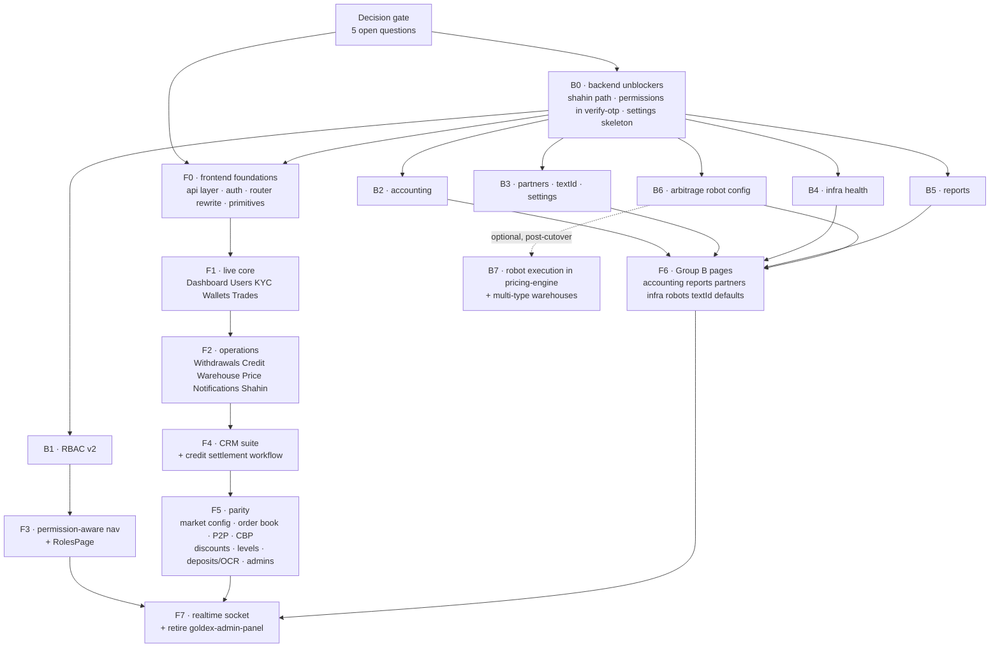

# Archived — Parszargar × Goldex delivery roadmap (September 2026)

> **This is a historical record, not a plan.** Nothing here describes current
> work, and the week numbers are wrong: they were written on 2026-09-04 against
> an explicit "planning complete, no implementation started", and a good deal
> has been built since. Do not schedule from this file.
>
> The live documents are `docs/PARSZARGAR-ADMIN-API-PLAN.md` (backend scope),
> `docs/UI-PARSZARGAR-API-CONTRACT.md` (page → endpoint index) and
> `docs/ADMIN-PANEL-PARITY-PLAN.md` (parity scope). Each supersedes the
> corresponding part of the roadmap this came from.
>
> Kept for one reason: the **dependency order**. The roadmap's own sizing note
> said the week numbers re-scale with the team but that the order of the work
> does not change, and that ordering is the part still worth being able to look
> up. It survives here; the dated lane chart, milestone detail and risk register
> from the original do not.

**Source:** `PARSZARGAR-ROADMAP.md` §1–2, from the branch
`ui-goldex-admin-plan-40u9fs` (commit `dfadff42`), which was never merged.

---

## 1. Milestones

| # | Milestone | Weeks | Definition of done |
|---|---|---|---|
| **M0** | Decisions & foundations | 1–2 | The five open questions are answered; a Parszargar page renders live backend data end-to-end |
| **M1** | Live core | 3–6 | Dashboard, Users, KYC, Wallets, Trades run on real data; mock generators deleted from those pages |
| **M2** | Roles & daily operations | 5–9 | RBAC v2 shipped; nav is permission-aware; Withdrawals, Credit, Warehouse, Price, Notifications, Shahin live |
| **M3** | Goldex domain import — CRM & Credit | 7–12 | CRM suite and the credit settlement workflow exist in the Parszargar design language |
| **M4** | Feature parity | 10–16 | Everything `goldex-admin-panel` does, Parszargar does |
| **M5** | New backend domains | 9–18 | Accounting, reports, partners, infra health, textId, settings, robot config all live; no stub pages remain |
| **M6** | Cutover | 18–20 | `goldex-admin-panel` read-only, then retired |

M2–M5 overlap heavily, so the table reads as a status summary rather than a
schedule. The lane chart it referred to is not carried over here — see the note
at the top of this file.

---

## 2. Dependency graph

**Critical path:** `Decisions → B0 → F0 → F1 → F2 → F4 → F5 → F7`.
Everything on the backend track after B0 is off the critical path *until* F6
needs it — which is why B2–B6 can start early and finish late without hurting.

---
