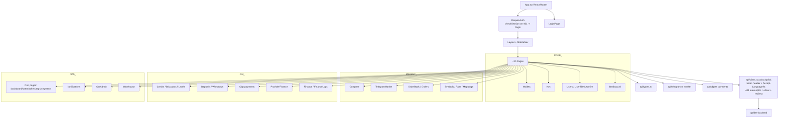
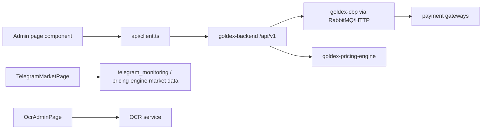

# goldex-admin-panel — Admin Web App

React (Vite) TS SPA for operators/admins: dashboard, users, KYC, wallets, finance, CBP payments, provider finance, orders/order-book, symbols/pairs/mappings, levels, discounts, credits, deposits/withdraws, OCR admin, telegram market, CRM. Single axios client to goldex-backend `/api/v1`.

## Architecture

## Data flow

> Auth token stored in `localStorage` (`goldex_admin_token`); every request sends `Accept-Language: fa`; any 401 clears the token and redirects to login. Backend responses are unwrapped from `{ status, message, data, errors }`.
