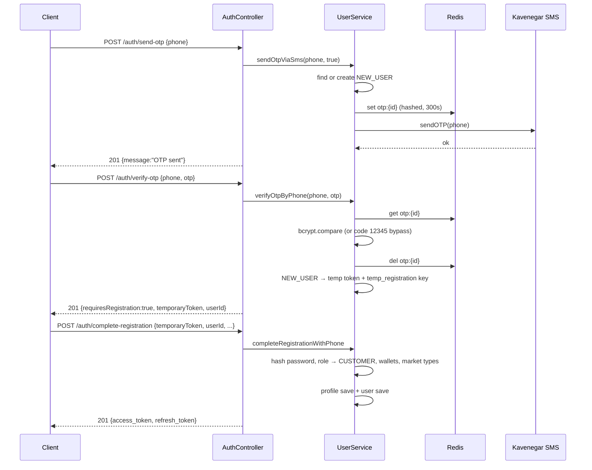
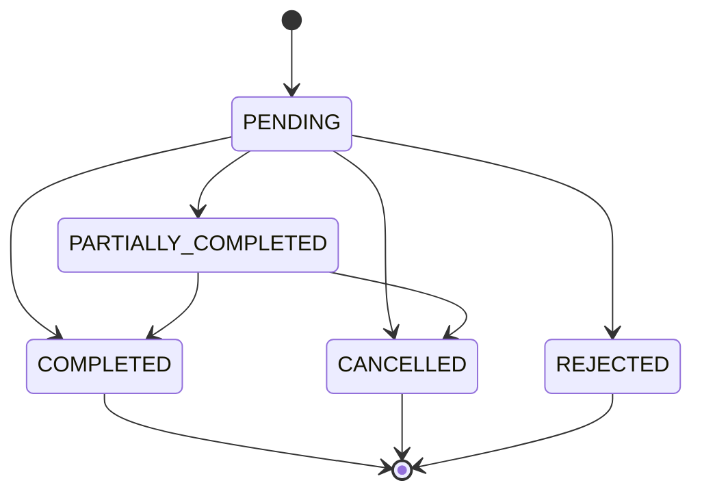
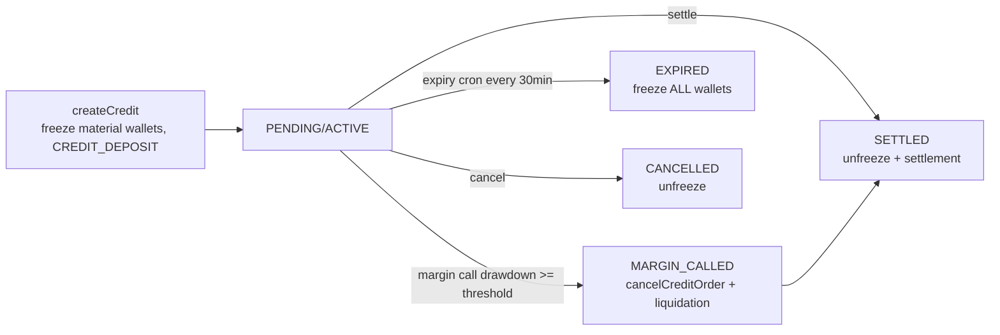
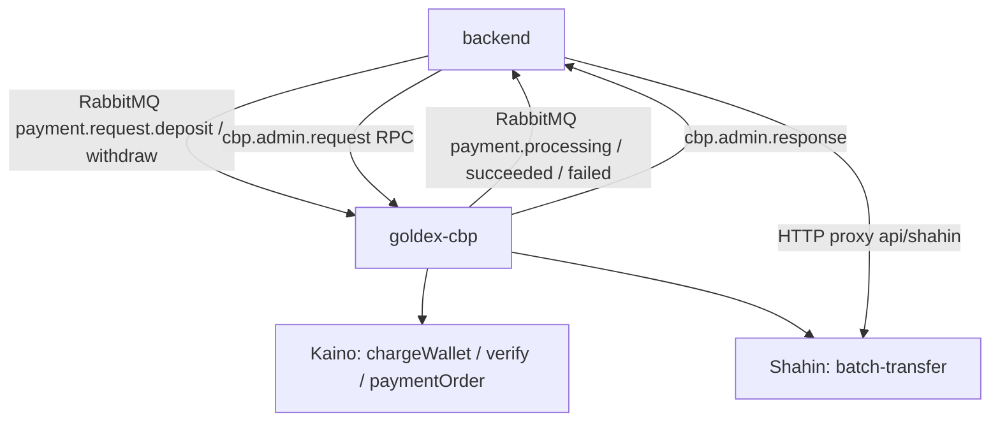

# goldex-backend — Feature & Architecture

Global prefix `api`, URI versioning `v1`. NestJS, TypeORM (Postgres), EventEmitter, ScheduleModule, JwtModule, I18n.

## Module architecture

```mermaid
flowchart TD
    App[AppModule] --> Core[Config / TypeOrm / Jwt / I18n / EventEmitter / Schedule / ServeStatic]
    App --> User[user: auth, 2FA, KYC, profile, devices]
    App --> Wallet[wallet: Wallet + Transaction + wallet-order]
    App --> Order[order: order + match + admin-order + order-book]
    App --> Quote[quote-request: custom-market P2P]
    App --> Admin[admin-management / admin-wallet / admin-kyc / admin-pair / admin-symbol]
    App --> Credit[credit: margin / expiry / settle]
    App --> Warehouse[warehouse: requests, packets, allocation]
    App --> Finance[provider-finance / financial / payment-bus / payment-callback]
    App --> Notif[notification / mail / sms / telegram-notifier / user-telegram]
    App --> Pricing[provider-pair-mapping / admin-monitoring / websocket market]
    App --> Misc[shahin / crm / user-level / discount / minio / ocr / redis / rabbitmq]
```



## Auth: OTP registration → login



## Custom-market (quote) flow

```mermaid
flowchart TD
    Q[POST /quote-requests] --> V{validate + lock balance}
    V --> P[create PENDING]
    P --> F{find opposite pending}
    F -->|compatible equal qty| S[settleMatchPair<br/>one txn, pessimistic locks]
    F -->|no match| A[alertMatchOpportunity<br/>notify seller]
    S --> MATCHED
    A --> P2[stays PENDING, await accept]
    P2 --> M[POST /{id}/match seller approves]
    M --> S
    S --> W[wallets: XAU seller→buyer, IRR buyer→seller<br/>net commissions]
```

## Order state machine (market / limit)



## Credit / lending lifecycle



## Payment / settlement (backend ↔ cbp)


