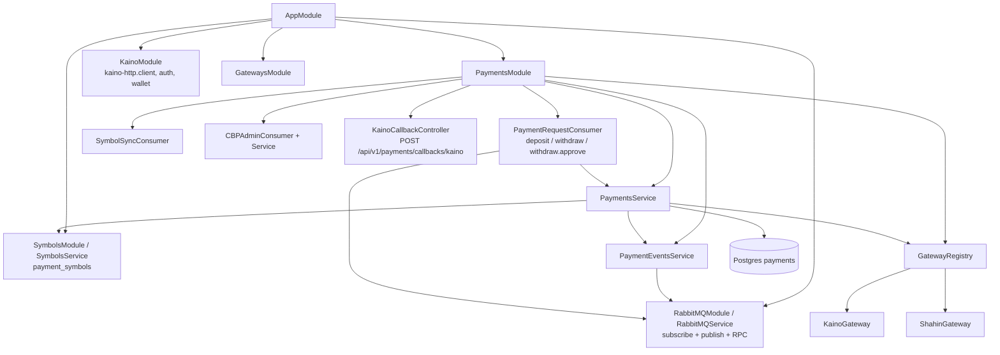
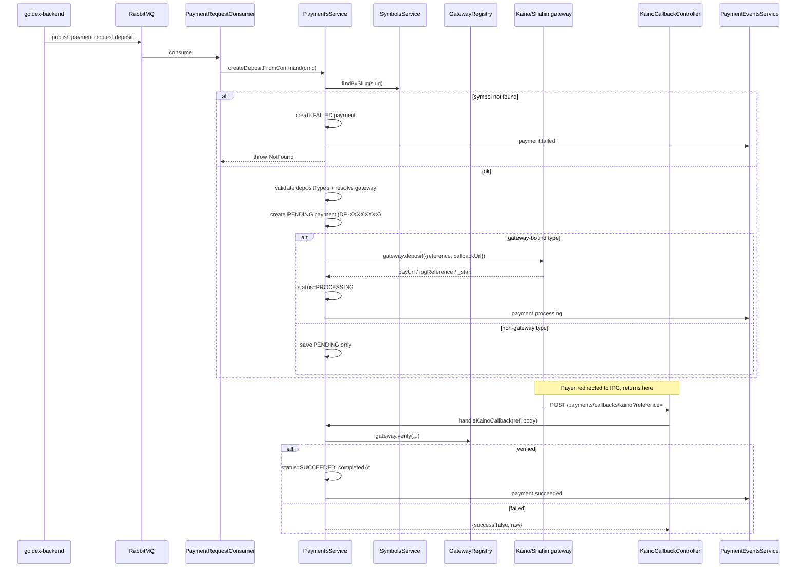
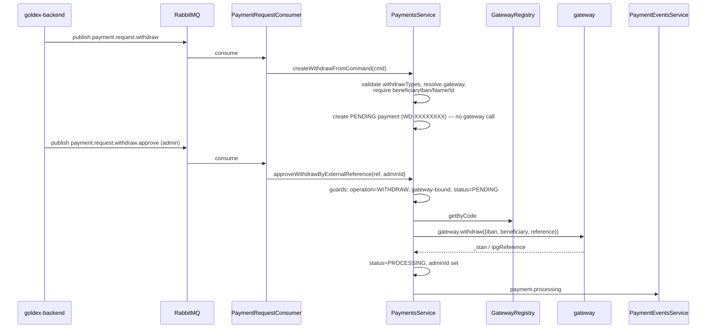
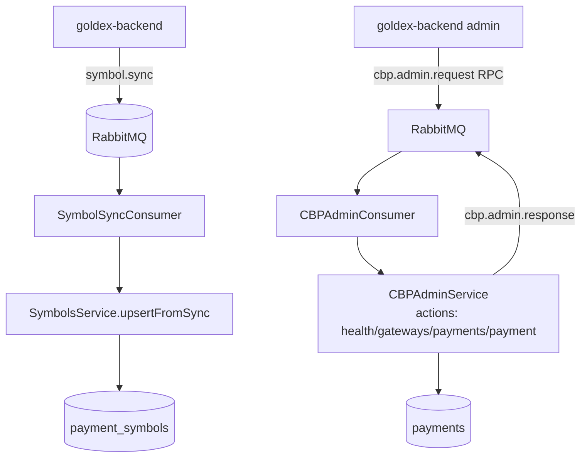
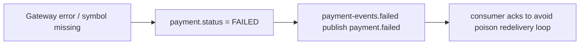

# goldex-cbp — Payment Engine

NestJS headless service. No user-facing HTTP API — driven entirely by RabbitMQ commands from goldex-backend, plus one external gateway callback endpoint. TypeORM Postgres (`payments`, `payment_symbols`).

## Module architecture

## Deposit flow (backend command → gateway → callback)

## Withdraw flow (approval → transfer)

## Admin RPC + symbol sync

## Failure handling

> Conventions: identifiers prefixed `DP-` (deposit) / `WD-` (withdraw); events only emitted when `externalReference` is set; non-gateway types stay PENDING without provider call.
