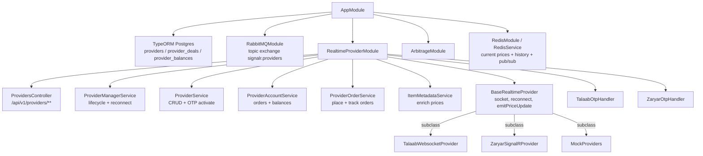
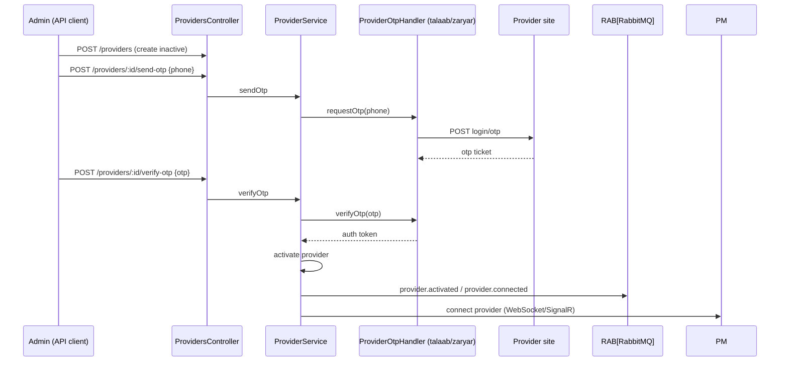
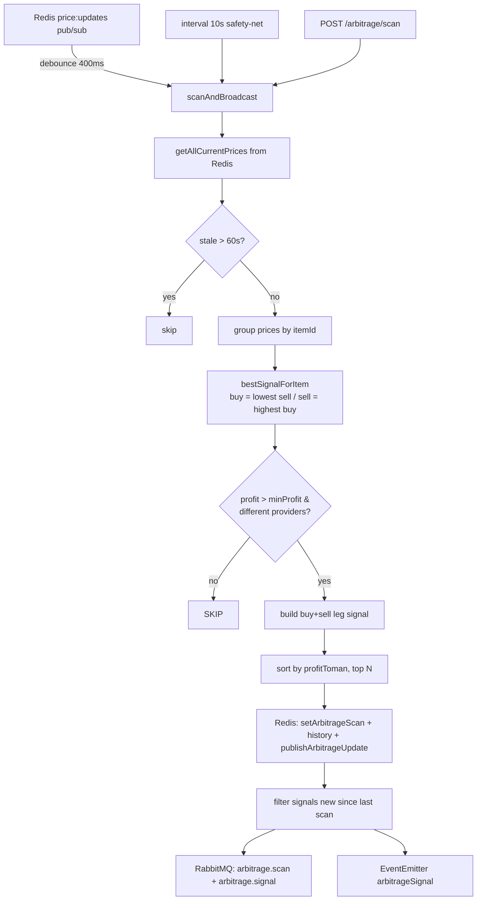
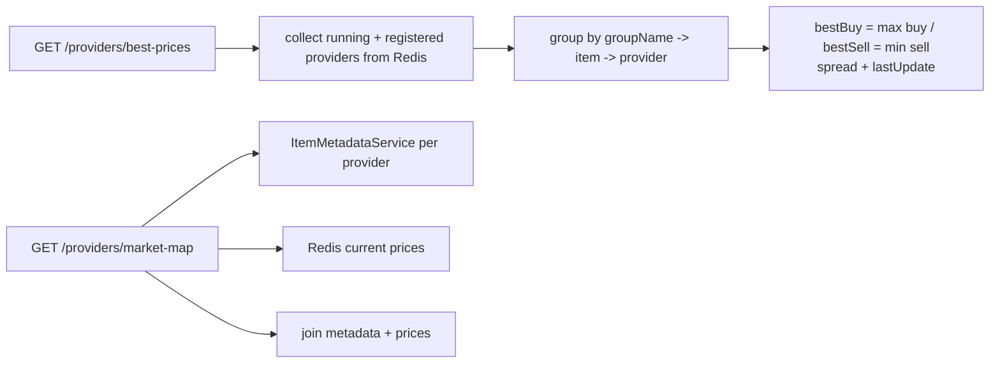

# goldex-pricing-engine — Real-time Provider Pricing + Arbitrage

NestJS service that connects to external gold providers over WebSocket/SignalR (Talaab, Zaryar), normalizes live prices, caches in Redis, publishes to RabbitMQ, and runs a real-time arbitrage scanner. TypeORM Postgres (`providers`, `provider_deals`, `provider_balances`).

## Module architecture



## Provider connection + price pipeline

```mermaid
flowchart LR
    P[Talaab / Zaryar / Mock] -->|SignalR / WS socket| BASE[BaseRealtimeProvider]
    BASE --> AUTH[authenticate / OTP verify]
    AUTH --> LISTEN[setupSocketListeners]
    LISTEN --> NORM[normalizePrices<br/>swap inverted buy/sell]
    NORM --> ENRICH[ItemMetadataService.enrich<br/>per-gram = mithqal / 4.3318, spread%]
    ENRICH --> EMIT[emitPriceUpdate]
    EMIT --> REDIS[Redis: setCurrentPrice + history + publishPriceUpdate]
    EMIT --> RAB[RabbitMQ: price.update (provider-scoped key)]
    DISCONN[connection lost] -->|backoff 3s * 2^n, max 10| RC[scheduleReconnect]
```

## OTP activation flow (provider on-boarding)



## Arbitrage engine



## Best prices + market map endpoints



> Conventions: prices keyed per provider in Redis; only fresh quotes (≤60s) feed arbitrage; signals only fan out when newly detected; providers auto-reconnect with exponential backoff.
