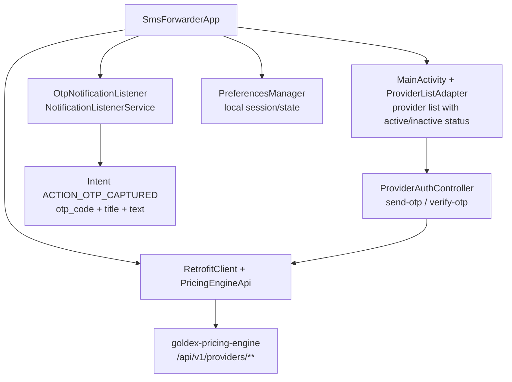
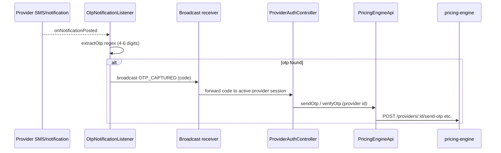

# goldex-sms-forwarder — Android OTP Forwarder

Android app (Kotlin, Jetpack) that listens for SMS/OTP notifications and forwards captured codes to the pricing-engine (provider OTP activation). Uses a `NotificationListenerService` and Retrofit to the pricing engine API.

## Architecture

## OTP capture → forward flow

> The listener parses the notification `title + text + bigText`, regex-extracts a 4–6 digit code, broadcasts it, and the UI/auth controller forwards it to the pricing engine to complete provider activation.
