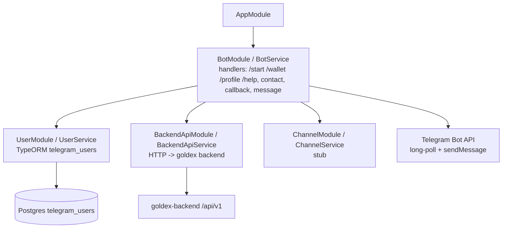
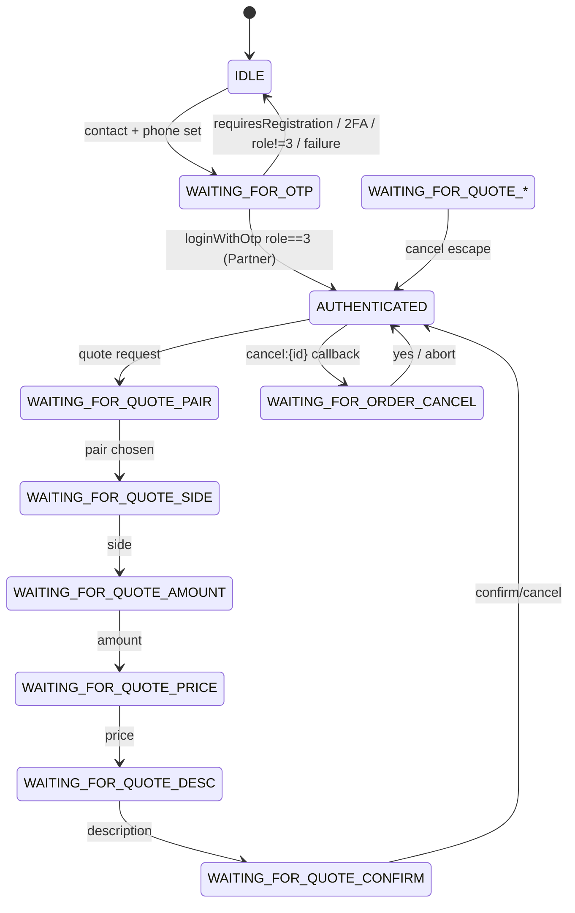
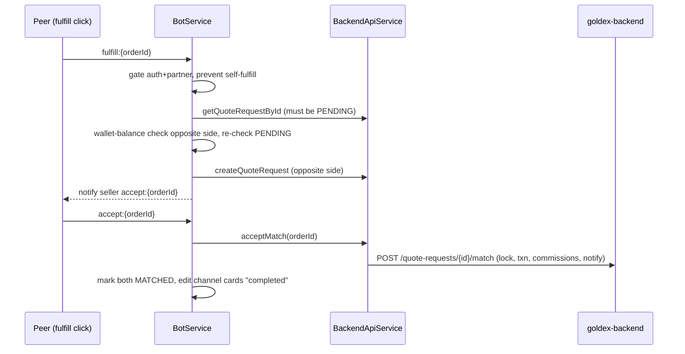
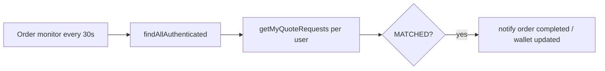

# goldex-telegram-bot — Feature & Architecture

Pure Telegram bot (long-polling, `node-telegram-bot-api`). No HTTP API. NestJS + TypeORM Postgres (`telegram_users`), talks to goldex-backend over HTTP `/api/v1`.

## Module architecture



## User state machine



## Quote → publish → match flow

```mermaid
sequenceDiagram
    participant U as User (DM)
    participant B as BotService
    participant BK as BackendApiService
    participant BE as goldex-backend
    participant CH as Telegram channel

    U->>B: choose pair/side/amount/price/desc
    B->>B: accumulate metadata, state chain F8a..F8f
    U->>B: confirm
    B->>B: wallet-balance check (buy: quote cur; sell: base)
    B->>BK: createQuoteRequest
    BK->>BE: POST /quote-requests
    BE-->>BK: PENDING orderId
    B->>B: track activeOrders[orderId]=PENDING
    B->>CH: publish order card (fulfill button)
    B->>B: scan opposite PENDING order (local)
    alt local match found
        B-->>U: notify buyer + seller (accept button)
    else backend matchAlert
        B-->>U: notify opportunity
    else none
        B-->>U: "published, wait"
    end
```

## Fulfill + accept (peer match)



## Background jobs



> Caveats: `/logout` is defined but never wired; `isChannelAdmin` and `ChannelService.sendMessage` are unused scaffolding; order/quote state lives in goldex-backend, not here.
