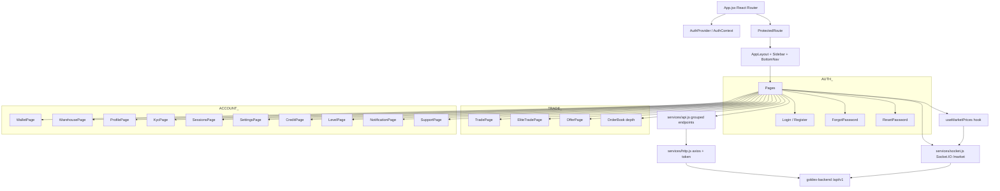
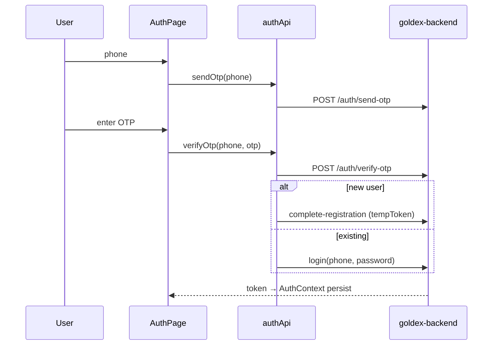
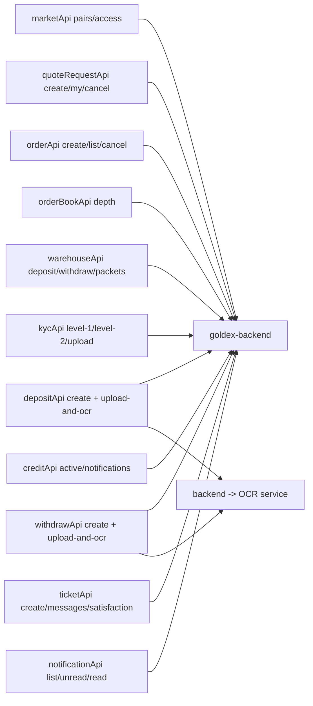

# goldex-user-panel — Customer Web App

React (Vite) SPA for customers: auth (phone+OTP / password), trading, wallets, warehouse, KYC, credit, levels, support tickets. Talks to goldex-backend REST + real-time Socket.IO (`/market`) for market prices.

## Architecture

## Auth flow

## Key data flows

> Endpoints group into: auth, profile, kyc, wallet, market, quote-requests, order-book, orders, warehouse, credit, base-info, deposit, withdraw, user-level, notifications, tickets. Public calls skip the auth header via `{ skipAuth: true }`.
