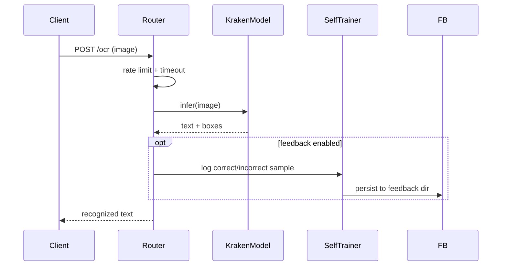
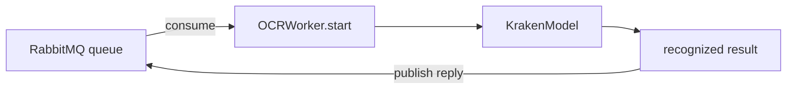

# kraken-ocr-service — OCR with Self-Training

FastAPI service using Kraken OCR with a self-training loop, RabbitMQ worker for async batch OCR, and rate limiting. Optional (RabbitMQ worker starts only if `aio-pika` installed).

## Architecture

```mermaid
flowchart TD
    App[FastAPI create_app] --> MID[Middleware: timeout + rate limiter]
    App --> ROUTER[app.router /ocr endpoints]
    App --> MODEL[KrakenModel<br/>configure_torch + load]
    App --> TRAINER[SelfTrainer<br/>self-training loop]
    App --> WORKER[OCRWorker<br/>RabbitMQ consumer (optional)]

    ROUTER --> MODEL
    TRAINER --> MODEL
    WORKER --> MODEL
    TRAINER --> FB[feedback_data_dir]
    ROUTER --> API[HTTP clients / goldex-backend]
    WORKER --> RMQ[RabbitMQ]
```

## Inference flow



## Async batch (RabbitMQ) flow



> Config via `app/config.py` (Settings): log level/JSON, inference timeout, rate limit, feedback on/off + dir, RabbitMQ connection.
