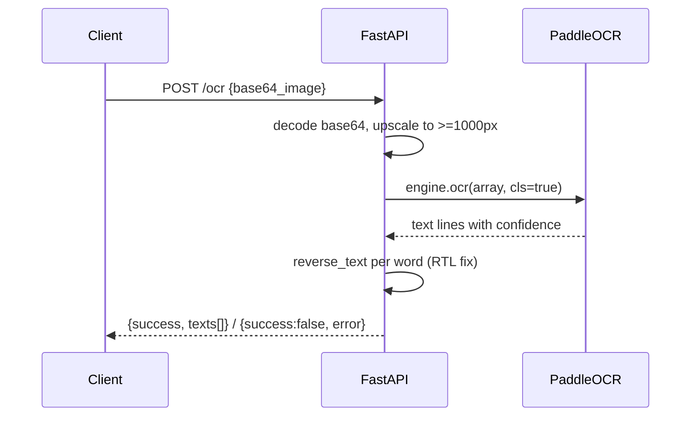

# paddle-ocr-service — Text Extraction

Small FastAPI service wrapping PaddleOCR (Arabic). Stateless, single HTTP endpoint. No DB, no queues.

## Architecture

```mermaid
flowchart TD
    CLI[Client / goldex-backend] -->|POST /ocr base64_image| APP[FastAPI app]
    APP --> P[PaddleOCR engine<br/>lang=arabic, use_angle_cls]
    APP --> UP[upscale image to min 1000px LANCZOS]
    UP --> ARR[to RGB numpy array]
    ARR --> P
    P --> REV[reverse each word's characters]
    REV --> RES[{success, texts[]}]
    CLI -->|GET /health| H[{status: ok}]
```

## OCR flow


