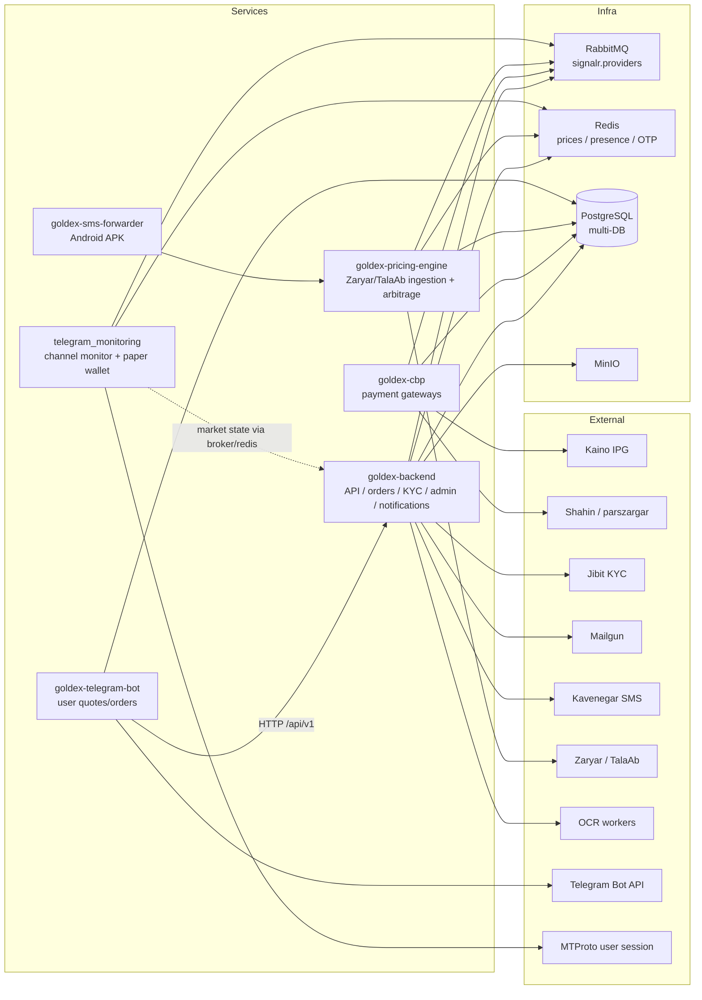

# Goldex System Architecture

Cross-service integration topology. Flows over RabbitMQ (topic exchange `signalr.providers`), Redis, shared PostgreSQL, and direct HTTP.

## Message flows on RabbitMQ (`signalr.providers`)

| From → To | Routing keys |
|---|---|
| backend → cbp | `payment.request.deposit`, `payment.request.withdraw`, `payment.request.withdraw.approve`, `symbol.sync`, `cbp.admin.request` |
| cbp → backend | `payment.processing`, `payment.succeeded`, `payment.failed`, `payment.rejected`, `cbp.admin.response` |
| pricing-engine → backend | `price.update`, `price.history`, `price.snapshot`, `provider.*`, `provider.deals.updated`, `provider.balance.updated` |
| backend → pricing-engine | `order.place.request` |
| telegram_monitoring → backend | `telegram.market.snapshot`, `telegram.opportunity` |

## Data stores

- **PostgreSQL** — `GOLDEX-DB` (backend), `gold_price_db` (pricing engine), `goldex_telegram_bot_db` (telegram bot), `payment-db` (cbp).
- **Redis** — backend (prices, OTP, presence); pricing engine (current/history/snapshot); telegram_monitoring (`wallet:*`, `price:*`, `arbitrage:*`, `opportunity:*`).
- **MinIO** — KYC documents, deposit/withdraw images, packet images.
