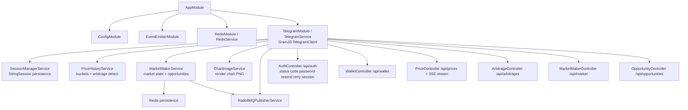
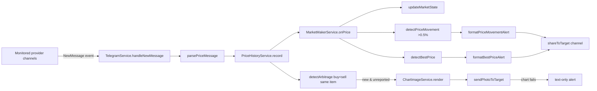
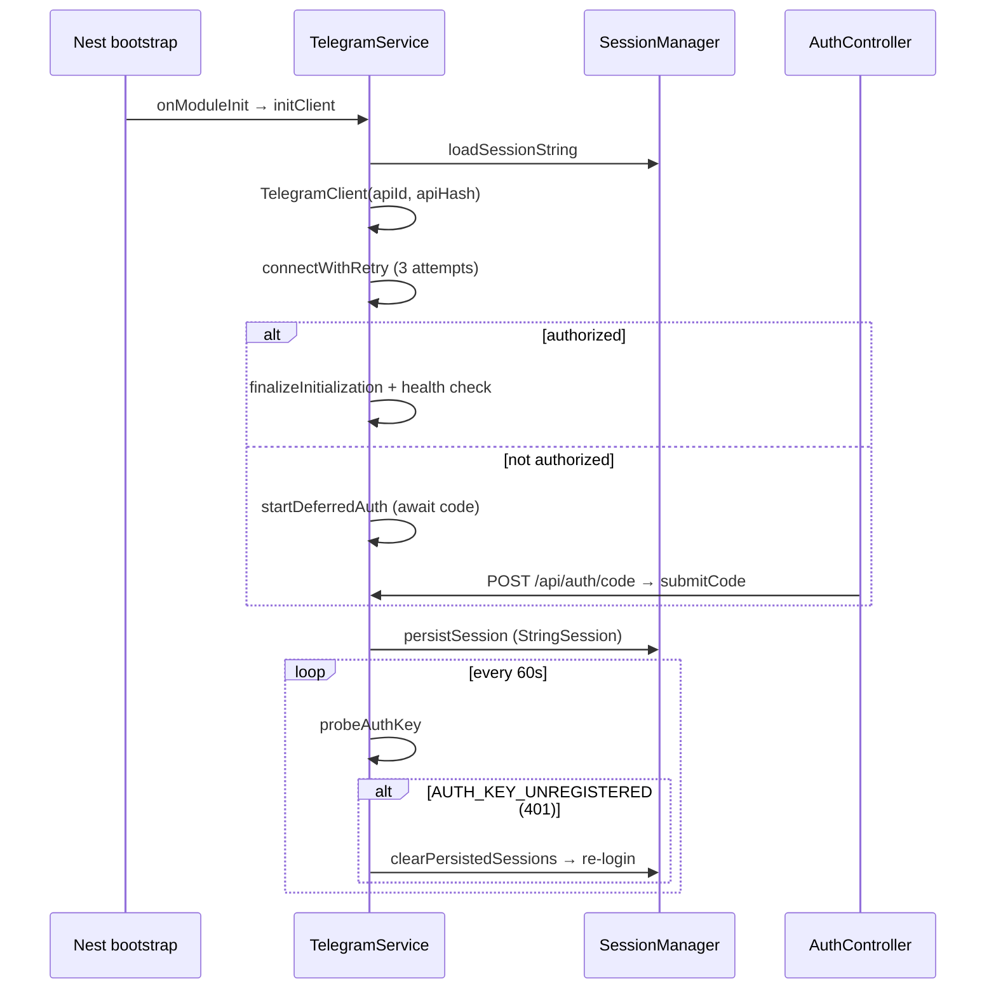
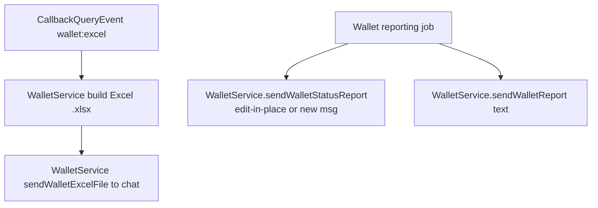

# telegram_monitoring — Telegram Channel Monitor + Market Maker

NestJS service that logs into Telegram via GramJS `TelegramClient`, monitors configured provider channels, parses live price messages, detects arbitrage / best-price / price-movement opportunities, renders chart images, and shares alerts to a target channel. Tracks a virtual wallet of executed trades and reports status (text + Excel) to a report channel. Redis-backed persistence + SSE + RabbitMQ pub.

## Module architecture



## Price monitor → opportunity pipeline



## Auth + connection lifecycle



## Callback / request routing



## HTTP + data view (admin dashboard)

```mermaid
flowchart LR
    UI[Dashboard /public/index.html] --> REST[REST controllers]
    REST --> W[Wallet /api/wallet · trades · symbols]
    REST --> P[Prices /api/prices · filters]
    REST --> A[Arbitrage /api/arbitrages · summary · wallet]
    REST --> M[Market /api/market · best-buys · best-sells]
    REST --> O[Opportunities /api/opportunities]
    REST --> SSE[/api/prices/stream SSE real-time]
    REST --> AUTH2[/api/auth status]
```

> Caveats: market-maker only tracks `subType=normal` with no description (ignores reversed/custom deals); wallet report message is edited in place to avoid flooding the channel; Redis is the persistence layer (no Postgres in this service).
